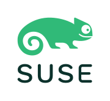

<!-- Some CSS styling for the page numbers. Ignore this. -->

<!-- More styling for image positions. -->

<!-- paginate: skip -->

<h1>Entwicklung eines FAT-Dateisystemtreibers im Linux Userspace</h1>

Christopher Hock
12.02.2025

<!-- _footer: "Slides
https://github.com/ByteOtter/talks/tree/main/cic_exam/ \n  © 2025 by Christopher Hock. Licensed under CC BY-NC-SA 4.0"
-->

---

# Index

1. Projektumfeld
2. Problemstellung
3. Projektziel
4. Projektplanung
5. Entwurf
6. Implementierung
7. Abnahme
8. Fazit

<!-- _footer: "© 2025 by Christopher Hock. Licensed under CC BY-NC-SA 4.0"
-->

---

<!-- paginate: true -->

# Projektumfeld

## SUSE

- Mehr als 2000 Mitarbeiter*innen in 21 Ländern
- Entwickelt Betriebssystemlösungen basierend auf eigener Linux-Distribution SUSE Linux
- Einnahmen durch Support-Verträge
- Kernel Storage & Networking Team

<!-- _footer: "© 2025 by Christopher Hock. Licensed under CC BY-NC-SA 4.0"
-->

---

# Problemstellung

<!-- _footer: "© 2025 by Christopher Hock. Licensed under CC BY-NC-SA 4.0"
-->

---

# Projektziel

<!-- _footer: "© 2025 by Christopher Hock. Licensed under CC BY-NC-SA 4.0"
-->

---

# Projektplanung

<!-- _footer: "© 2025 by Christopher Hock. Licensed under CC BY-NC-SA 4.0"
-->

---

# Entwurf

<!-- _footer: "© 2025 by Christopher Hock. Licensed under CC BY-NC-SA 4.0"
-->

---

# Implementierung

<!-- _footer: "© 2025 by Christopher Hock. Licensed under CC BY-NC-SA 4.0"
-->

---

# Abnahme

<!-- _footer: "© 2025 by Christopher Hock. Licensed under CC BY-NC-SA 4.0"
-->

---

# Fazit

<!-- _footer: "© 2025 by Christopher Hock. Licensed under CC BY-NC-SA 4.0"
-->