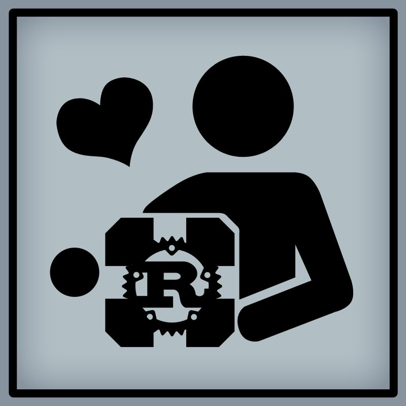

<!-- Some CSS styling for the page numbers. Ignore this. -->

<!-- START HERE. -->

<!-- paginate: skip -->

# Open-Source Software

Christopher Hock

<!-- _footer: "Slides
https://github.com/ByteOtter/talks/misc/ \n © 2024 by Christopher Hock is licensed under CC BY-NC-SA 4.0"
-->

---

<!-- paginate: skip -->

# Index

1. Who am I?
2. What is FOSS?
3. Why FOSS?
4. How can I help?

---

# Task for you

On each slide is a different FOSS mascot or logo, can you spot them all?

The first to give me a complete list gets a free cookie! :cookie:

---

<!-- paginate: true -->

# Who am I?

- Chris
- 25 Years old
- Appr. Software Engineering @ SUSE
- Experience mostly in Python and Rust
- Open source contributions since 2021/22

---

# What is FOSS?

*"Free as in **freedom**, **not** free beer."*

- Source code and other resources are publicly available
- Little restriction on modification and redistribution
- Built as a collective by people around the world
- Commerical or uncommercial use possible depending on license

<!--Solution: The Open Source Initiative https://https://opensource.org/ -->

---

# What is FOSS?

Many important services are dervied from, based off, or are themselves FOSS projects.

- Linux (subsequently Android)
- git (subsequently a lot of "Git forges" -> GitLab, Gitea, etc.)
- Nearly all network protocols
- Basically all Database systems
- All modern programming languages & frameworks

<!--
- Container Engines (Docker/Kubernetes)
- Apache Web Server
- HTTPS, TCP/IP, SSL/TLS
- MySQL, MariaDB, etc
- Python, C, C++, Rust, PowerShell & .NET Core
-->

<!--Solution: Tux, the Mascot of the Linux Kernel https://kernel.org/ -->

---

# Why FOSS?

Why not?

<!-- Solution: openSUSE (my beloved) https://get.opensuse.org -->

---

# Why FOSS?

- Control over the software
- **Security** through peer review
- Stability through review & conservation
- **Privacy** by culture
- **Training** through low barrier of entry

<!--
- **Control** over the software you use and its feature set
- **Security** thanks to thousands of reviewers or being able to review yourself
- **Training** on technical topics; Often used as entry to programming / software engineering
- **Stability** projects do not just vanish if the company behind it stops it
- **Privacy** higher privacy focus thanks to the environment it is developed in
-->

<!-- Solution: The little icon in the companion cube is the Logo of the Rust programming language. https://www.rust-lang.org/ -->

---

## Security

- No security by obscurity
- Many thousands of eyes on the code interested in a secure application
- Every change can be reviewed by anyone at any time
- Pushing malicious code into projects is way harder due to the number of reviewers

<!--
- Security not left to chance
- Thousands of eyes reviewing changes (random audits potentially)
- Many different viewpoints and backgrounds of contributors
- Discussions are held in the open in issues and bugtrackers
- Responsible disclosure
- Uni banned for trying to push malicious code in Linux kernel
-->

<!-- Solution: Wireguard. A fast, encrypted VPN service. https://www.wireguard.com/ -->

---

## Privacy

- FOSS users and contributors love themselves some privacy
- Much harder for individuals or organizations to push for more telemetry
- Thanks to OSS licenses, forking projects before unpopular changes is an option (-> Brave Browser)

<!-- Solution: The icon of the Tor browser. https://www.torproject.org/ -->

---

## Training

- Knowledge is shared everywhere
- No real barriers to entry
- Public record of your skills and interest on GitHub or similar
- Past work and achievements not under NDA
- Experience sharing with some of the brightest minds in their field

---

# How can I help?

- No need to be a developer
- Artists, translators, documentation people, hardware and networking for
hackspaces or FOSS events, etc. etc.

<!-- Solution: KDE's mascot: Konqi and his friends. htpps://kde.org/ -->

---

# How can I help?

1. Read about open-source and the ideas behind it.
    1.1 [opensource.com](https://opensource.com/resources/what-open-source)
2. Become a contributor:
    2.1. [openSUSE](https://opensuse.org)
    2.2. [KDE e.V](https://kde.org)
    2.3. [Fedora](https://docs.fedoraproject.org/en-US/fedora-join/)
3. Get involved in your local hackspace:
    3.1 [0x90 e.V](https://0x90.space/)
    3.2 [Nerdberg](https://wiki.nerdberg.de/index.php/Hauptseite)
4. Start getting involved

---

# Questions? Get in touch!

Mail: [christopher-hock@protonmail.com](mailto:christopher-hock@protonmail.com)
GitHub: [github.com/ByteOtter](https://github.com/ByteOtter)
Website: [byteotter.gay](https://byteotter.gay)
Matrix: @chris:kde.org

---

# Sources

- https://opensource.com/resources/what-open-source
- https://en.wikipedia.org/wiki/Open-source_software
- https://ibm.com/topics/open-source
- https://opensuse.org
- https://fedoraproject.org

<!-- _footer: "Background Images used licensed under the CC0 and Unsplash licenses allowing for use without attribution.\nI am not sponsored nor customer at these stores.\n
Logos and artwork of the FOSS projects and organizations belong to their respective owners." -->
